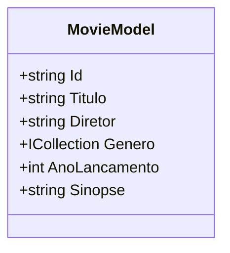

# 🎬 Movix CRUD API

**Movix** é uma API simples e eficiente para o gerenciamento de filmes, construída com .NET e utilizando MongoDB como banco de dados. Esta API fornece uma maneira prática de realizar operações de CRUD (Criar, Ler, Atualizar e Excluir) em um catálogo de filmes.

## 📚 Funcionalidades

A seguir visualize as funcionalidades da API:

| Ação                        | Descrição                                                                                     |
|-----------------------------|-----------------------------------------------------------------------------------------------|
| **➕ Adicionar Filmes**      | Adicione facilmente novos filmes ao catálogo com os detalhes relevantes.                      |
| **📜 Listar Filmes**        | Recupere uma lista de todos os filmes no catálogo, com filtros opcionais para facilitar a busca. |
| **🔍 Consultar Detalhes**   | Acesse informações detalhadas sobre um filme específico, incluindo título, diretor, gênero, ano de lançamento e sinopse. |
| **✏️ Atualizar Filmes**     | Modifique os detalhes dos filmes existentes para manter o catálogo atualizado.               |
| **❌ Excluir Filmes**       | Remova filmes do catálogo quando não forem mais necessários.                                 |

## 🚀 Começando

### 📋 Pré-requisitos

- [.NET SDK](https://dotnet.microsoft.com/download)
- [MongoDB](https://www.mongodb.com/) (MongoDB Atlas recomendado)

### 📥 Instalação

1. **Clone o repositório:**
   ```bash
   git clone https://github.com/laiscrz/movix-crud-api.git
   cd movix-crud-api
   ```

2. **Configure o MongoDB:**
   - Crie uma conta no MongoDB Atlas e configure um novo cluster (ou use uma instância local do MongoDB).
   - Anote sua string de conexão e o nome do banco de dados.

3. **Atualize a configuração:**
   - Modifique o arquivo `appsettings.json` com os detalhes de conexão do MongoDB.

4. **🛠️ Execute a aplicação:**
   ```bash
   dotnet run
   ```

### 📊 Diagrama - Classe Base



## 📡 Endpoints da API

### 1. **Adicionar um novo filme**

- **Método:** `POST`
- **Endpoint:** `/api/movies`
- **Corpo da Requisição:**
```json
{
  "titulo": "Nome do Filme",
  "diretor": "Nome do Diretor",
  "genero": ["Ação", "Aventura"],
  "anoLancamento": 2024,
  "sinopse": "Uma breve descrição do filme."
}
```

### 2. **Listar todos os filmes**

- **Método:** `GET`
- **Endpoint:** `/api/movies`
- **Resposta:**
```json
[
  {
    "id": "646cfe3538d5c5a77e7d4e12",
    "titulo": "Nome do Filme",
    "diretor": "Nome do Diretor",
    "genero": ["Ação", "Aventura"],
    "anoLancamento": 2024,
    "sinopse": "Uma breve descrição do filme."
  }
]
```

### 3. **Obter detalhes de um filme específico**

- **Método:** `GET`
- **Endpoint:** `/api/movies/{id}`
- **Resposta:**
```json
{
  "id": "646cfe3538d5c5a77e7d4e12",
  "titulo": "Nome do Filme",
  "diretor": "Nome do Diretor",
  "genero": ["Ação", "Aventura"],
  "anoLancamento": 2024,
  "sinopse": "Uma breve descrição do filme."
}
```

### 4. **Atualizar um filme existente**

- **Método:** `PUT`
- **Endpoint:** `/api/movies/{id}`
- **Corpo da Requisição:**
```json
{
  "titulo": "Nome Atualizado do Filme",
  "diretor": "Nome do Diretor Atualizado",
  "genero": ["Drama", "Comédia"],
  "anoLancamento": 2024,
  "sinopse": "Uma nova descrição do filme."
}
```

### 5. **Excluir um filme**

- **Método:** `DELETE`
- **Endpoint:** `/api/movies/{id}`
- **Resposta:** 
```json
{
  "message": "Filme excluído com sucesso."
}
```

## 💻 Tecnologias

As seguintes ferramentas foram usadas neste projeto:

### 🖥️ Ambientes de Desenvolvimento Integrado (IDEs):


### 📚 Linguagem de Programação:


---


> Este README fornece todas as informações necessárias para utilizar a Movix CRUD API de forma eficaz.
> **Aproveite sua experiência com o Movix! 🎥**
