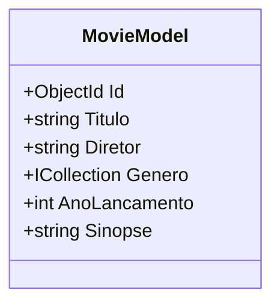

# 🎬 Movix CRUD API

> **Desenvolvido por:** Lais Alves da Silva Cruz - RM552258 👩‍💻

#### ⭐ Destaque/Nota: 
> Este projeto foi submetido como parte do Checkpoint 5° Avaliativo da disciplina Advanced Business With .NET e **recebeu nota máxima na avaliação do professor**, no 4° semestre do curso de Análise e Desenvolvimento de Sistemas na FIAP.

**Movix** é uma API intuitiva e eficiente projetada para o gerenciamento de filmes, construída com .NET e utilizando o MongoDB Atlas como banco de dados. A Movix facilita a realização de operações de CRUD (Criar, Ler, Atualizar e Excluir) em um catálogo de filmes, permitindo que os usuários gerenciem suas coleções de maneira prática e eficaz.


## 🛠️ Funcionalidades e Endpoints da API

Explore os principais endpoints da API para gerenciar seu catálogo de filmes:

| Função                                    | Endpoint                     | Método | Descrição                                                                                     |
|-------------------------------------------|------------------------------|--------|-----------------------------------------------------------------------------------------------|
| ➕ **Adicionar um Filme**                  | `POST /api/movies`          | POST   | Adiciona um novo filme ao catálogo.   |
| 📜 **Listar Todos os Filmes**             | `GET /api/movies`           | GET    | Retorna uma lista de todos os filmes cadastrados no catálogo.   |
| 🔍 **Obter Detalhes de Filme**            | `GET /api/movies/{id}`      | GET    | Acessa informações detalhadas de um filme específico pelo seu ID, permitindo ver todos os atributos do filme. |                            |
| ✨ **Buscar Filmes por Título**           | `GET /api/movies/search?title={title}` | GET    | Retorna uma lista de filmes cujo título contém a parte específica fornecida.                 |
| 📅 **Filtrar Filmes por Ano**             | `GET /api/movies/year/{year}` | GET    | Lista todos os filmes lançados em um ano específico.       |
| ✏️ **Atualizar um Filme**                  | `PUT /api/movies/{id}`      | PUT    | Atualiza os detalhes de um filme existente.      |
| ❌ **Excluir um Filme**                    | `DELETE /api/movies/{id}`   | DELETE | Remove um filme do catálogo.        |


> [!IMPORTANT] 
> **💡 Dica:** Exemplos dos endpoints estão disponíveis no arquivo [WebApi.http](https://github.com/laiscrz/movix-crud-api/blob/main/WebApi/WebApi.http).

---

## 📂 Estrutura do Projeto

- **📦 DTOs**: Objetos de transferência de dados para requisições e respostas.

- **🗄️ Data**: Configurações e classes para a conexão com o MongoDB.

- **🗺️ Mapping**: Mapeamento entre DTOs e modelos de domínio.

- **🎬 Models**: Estruturas que representam os dados da aplicação.

- **🏛️ Repositories**: Classes para acesso e manipulação de dados no banco.

- **🧪 Tests**: Testes unitários e de integração para garantir a funcionalidade do código.

- **⚙️ WebApi**: Controladores que gerenciam as operações da API.

> **`appsettings.json`**: Configurações gerais da aplicação, incluindo a string de conexão do MongoDB.

---

## 🎞️ Modelo de Filme

A classe `MovieModel` representa a estrutura dos filmes na API Movix.


```mermaid
classDiagram
    class MovieModel {
        +ObjectId Id
        +string Titulo
        +string Diretor
        +ICollection<string> Genero
        +int AnoLancamento
        +string Sinopse
    }
```

---

## 🗺️ AutoMapper

**AutoMapper** é uma biblioteca poderosa que simplifica o mapeamento entre objetos de diferentes tipos, como DTOs e Models, eliminando a necessidade de mapeamentos manuais repetitivos. 🚀✨

### **Por que usar AutoMapper?** 🔧

- **🔄 Redução de Código Repetitivo**: Elimina a necessidade de escrever código de mapeamento manual.
- **🛠️ Manutenção Facilitada**: Facilita a atualização de mapeamentos centralizados.
- **🔍 Consistência**: Garante mapeamentos consistentes em toda a aplicação.
- **⚡ Performance**: Otimizado para desempenho, adequado para a maioria das aplicações.
  
---

## 🔍 Testes

A API Movix CRUD possui duas categorias principais de testes:

### 🧪 Testes Unitários

- **🎥 `MovieModelTests`**: Testa a classe `MovieModel` para garantir a validação e criação correta.
- **🔄 `MovieMappingProfileTests`**: Valida o mapeamento entre DTOs e modelos de domínio.

### 🔗 Testes de Integração

- **📋 `MoviesControllerTests`**: Verifica se as operações do controlador funcionam corretamente.
- **🔍 `MovieRepositoryTests`**: Testa as operações de acesso a dados no repositório.

### Resultados dos Testes ✅

- No total, foram implementados **22 testes**: **7 unitários** 🧪 e **15 de integração** 🔗.
- **Todos os testes foram executados com sucesso**, assegurando a robustez da aplicação.


> [!WARNING]  
> **Atenção:** Os testes são realizados com o framework xUnit, assegurando a cobertura de funcionalidades.

---

## 📚 Documentação - Swagger

A documentação da API Movix está disponível na interface Swagger, que fornece uma descrição interativa de todos os endpoints e suas funcionalidades. Você pode acessar a documentação na raiz do projeto:

```https
http://localhost:5072
```

> [!NOTE]
> 📝 A documentação estará acessível apenas após o projeto ser iniciado localmente. 

---

## 💻 Tecnologias

- **IDE**: Visual Studio 🖥️
- **Linguagem**: C# 🟢
- **Framework**: .NET 🔵
- **Banco de Dados**: MongoDB Atlas🍃
- **Mapeamento de Objetos**: AutoMapper 🔄
- **Testes**: xUnit 🧪

---

### 🔗 Links Úteis

- [MongoDB Atlas](https://www.mongodb.com/cloud/atlas) - Plataforma de banco de dados na nuvem do MongoDB.
- [Documentação do AutoMapper](https://automapper.org/) - Guia e referências para o AutoMapper.
- [xUnit](https://xunit.net/) - Framework de testes utilizado no projeto.
  
---

## ⚙️ Execução do Projeto

1. Clone o repositório:
   ```bash
   git clone https://github.com/laiscrz/movix-crud-api.git
   cd movix-crud-api
   ```

2. Configure o MongoDB 🍃 e atualize `appsettings.json` com a string de conexão.

3. **Para executar a API** 🚀:
   ```bash
   cd WebApi
   dotnet run
   ```

4. **Para executar os testes** 🧪:
   ```bash
   cd Tests
   dotnet test
   ```

---

## 📄 Licença

Licenciado sob a licença MIT. Consulte o arquivo [LICENSE](https://github.com/laiscrz/movix-crud-api/blob/main/LICENSE).

---

> Este README fornece todas as informações necessárias para utilizar a Movix CRUD API de forma eficaz.
> **Aproveite sua experiência com o Movix API! 🎥**
